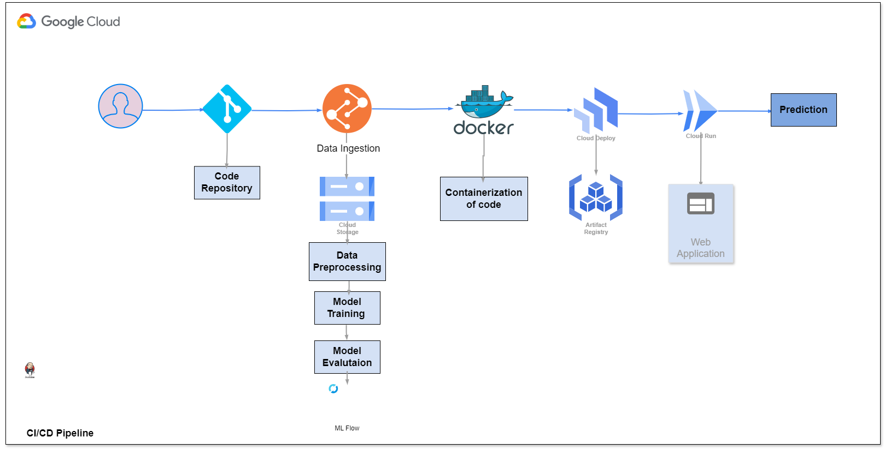

# AI-Hotel-Reservation-System

## Overview  
AI-Hotel-Reservation-System is a machine learning-based hotel booking prediction system that leverages **LightGBM** for classification and **MLflow** for model tracking. The system is containerized using **Docker** and deployed on **Google Cloud Platform (GCP)** for scalability and ease of deployment.

## Architecture Diagram  
  

## Technologies Used  
- **Python, LightGBM, Scikit-learn** – Model training and evaluation  
- **MLflow** – Experiment tracking  
- **Docker** – Containerization  
- **Google Cloud Platform (GCP)** – Hosting and deployment  
- **Jenkins & GitHub Actions** – CI/CD automation

